## 🔍 WebAppSec - Web Reconnaissance & Vulnerability Scanning Toolkit
#### 🧾 Overview
WebAppSec is a comprehensive automated toolkit designed to perform a full recon and vulnerability analysis on web applications. It combines powerful open-source tools with custom Python logic to enumerate subdomains, scan open ports and services, extract endpoints and JavaScript files, perform fuzzing, detect vulnerabilities like XSS and SQL injection, and identify open redirect flaws.
- This tool is best suited for bug bounty hunters, penetration testers, and security researchers.

🧰 Requirements
✅ Tools Needed:

Ensure the following tools are installed and accessible in your system’s PATH:
- python3
- pip
- nmap
- whatweb
- subfinder
- assetfinder
- dalfox
- sqlmap
- Gxss

📦 Python Libraries:
- requests
- beautifulsoup4


### 🛠 Installation
#### 🔧 Install System Tools (Linux):

```
sudo apt update
sudo apt install -y nmap whatweb python3-pip
go install -v github.com/projectdiscovery/subfinder/v2/cmd/subfinder@latest
go install -v github.com/tomnomnom/assetfinder@latest
go install github.com/hahwul/dalfox/v2@latest
go install github.com/KathanP19/Gxss@latest
```

#### 📦 Install Python Libraries:
```pip3 install requests beautifulsoup4```

#### Input 
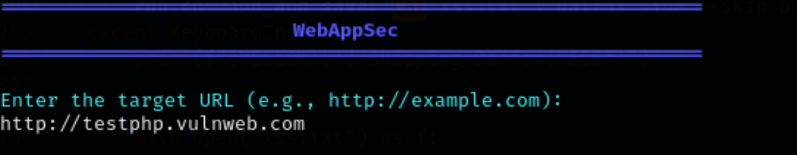

#### Subdomain Enumeration 
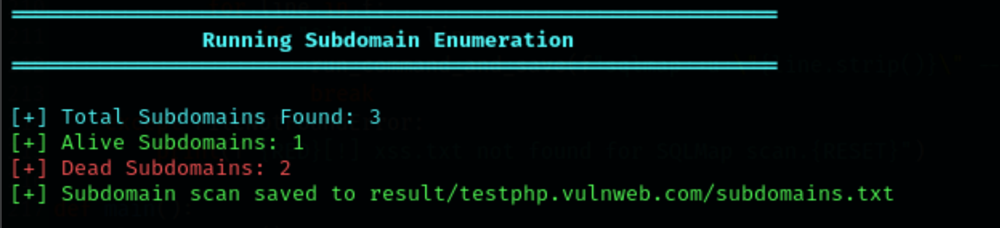

#### Scanning for the open ports
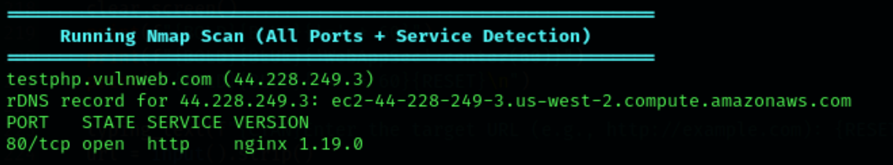

#### Running whatweb (website fingerprinting tool used to identify technologies and platforms a website is running on. )
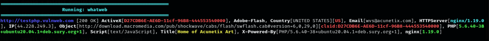

#### Finding All Endpoints
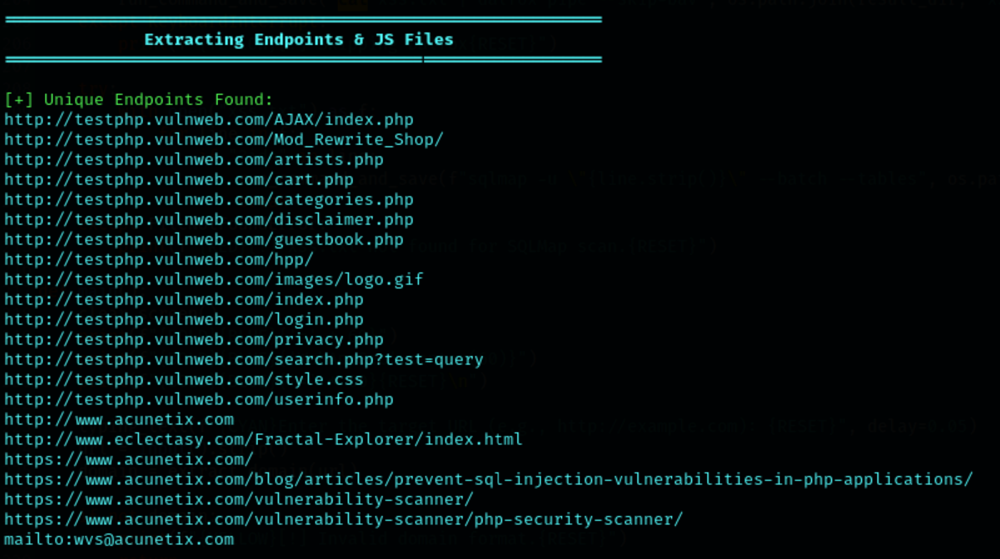

#### Extracting All URLs from Internet 
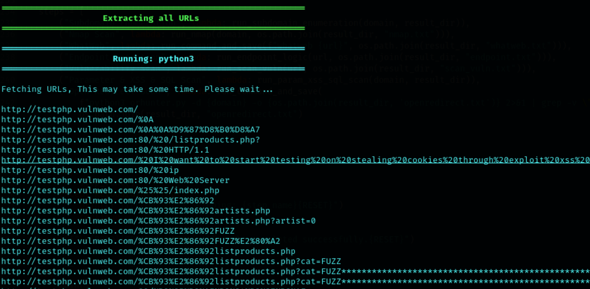

#### Finding the Vuln Parameter 
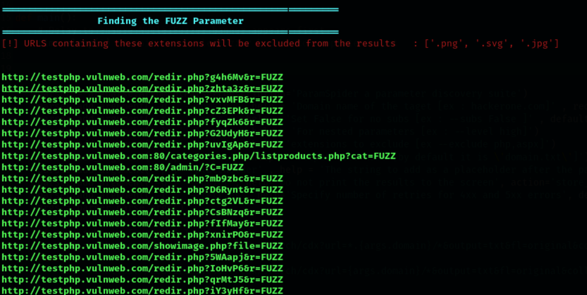

#### Saving the result 
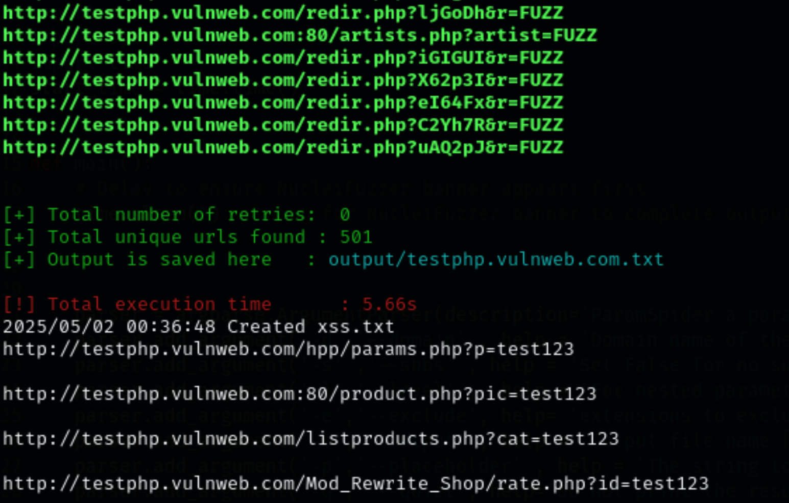

#### XSS vuln found
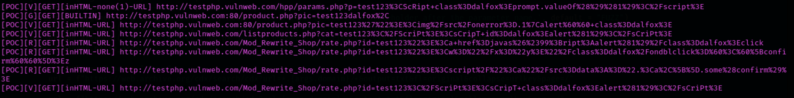

#### Running sqlmap
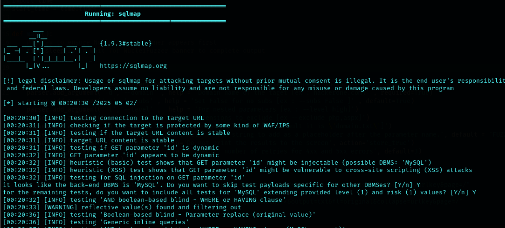

#### Getting the Database and table names
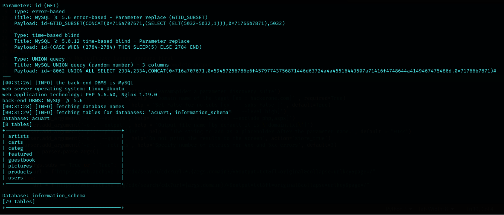

#### Finding Open Redirect Vulnerability
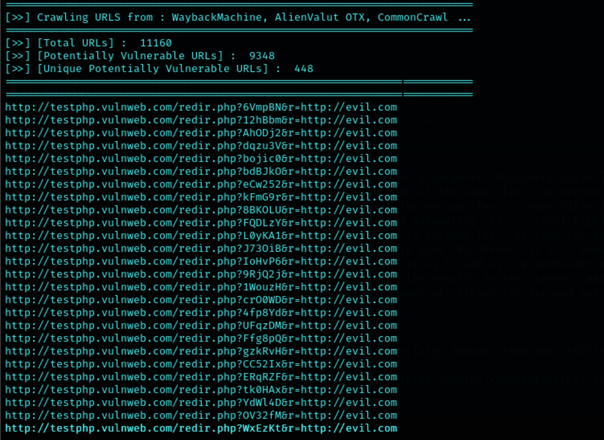

#### Saving the all output
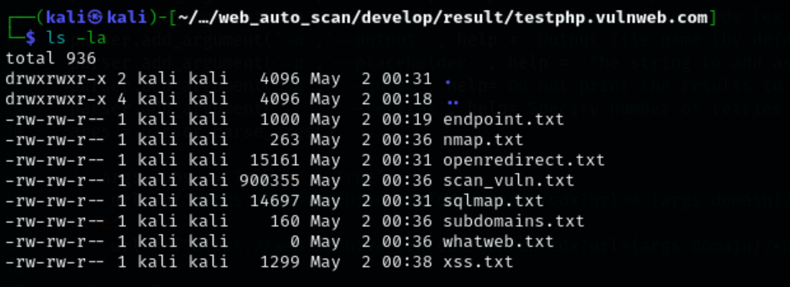

